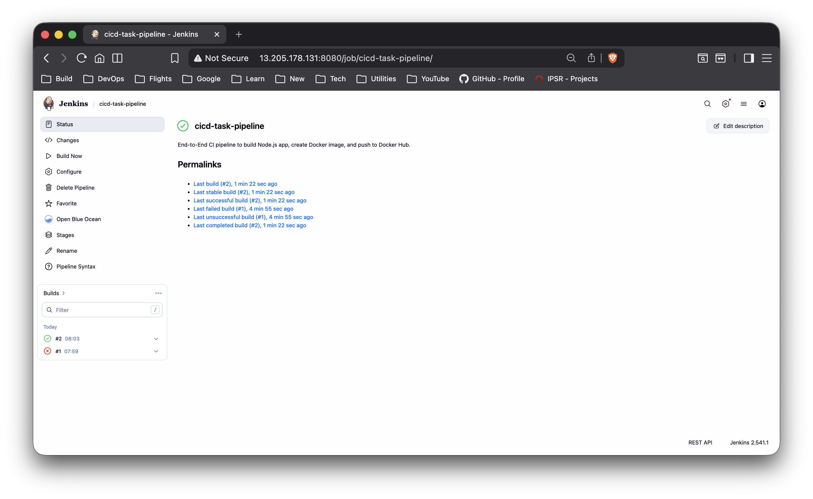
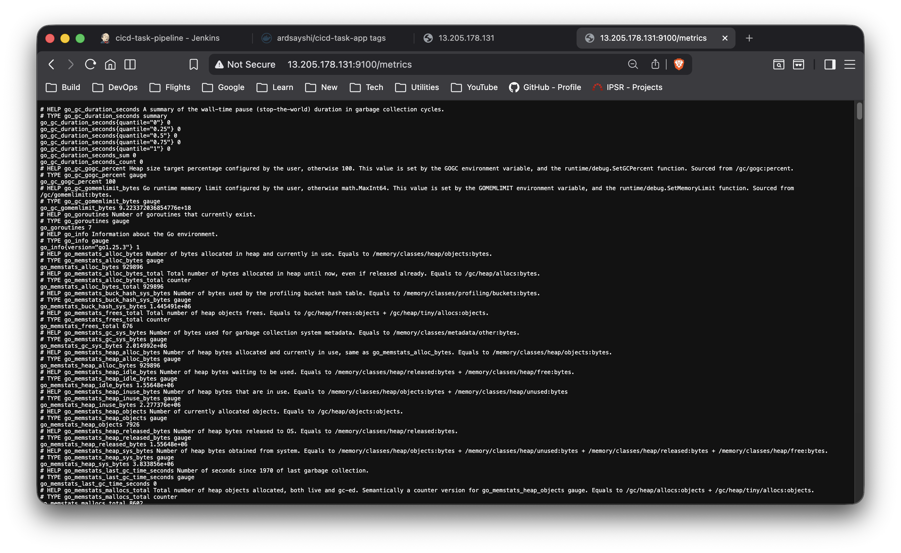
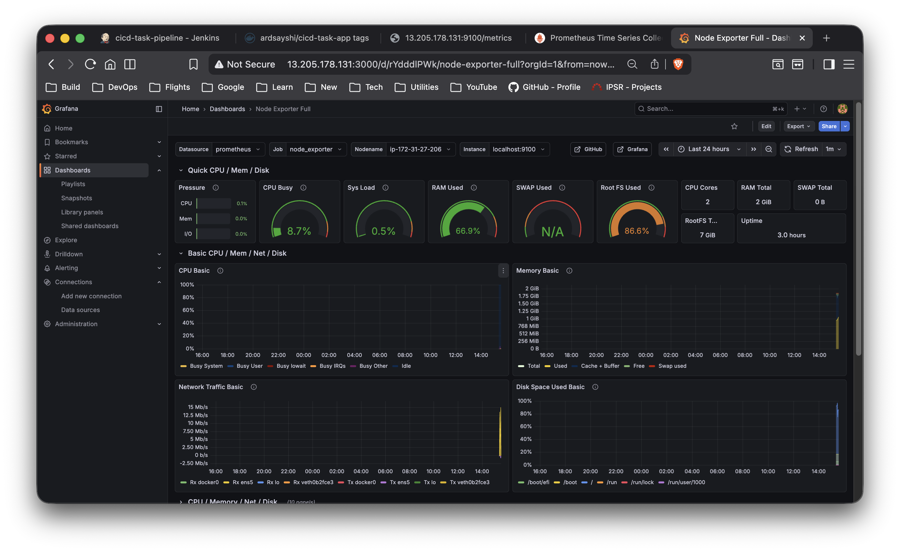

# End-to-End CI/CD Pipeline with Monitoring on AWS

## Overview
Designed and implemented a production-style DevOps workflow that automates the application lifecycle from code commit to Kubernetes-based deployment and infrastructure monitoring on AWS.

---

## Continuous Integration & Continuous Deployment (CI/CD)

- Source code hosted on GitHub  
- GitHub Webhooks configured to automatically trigger Jenkins on every code push  
- Jenkins Declarative Pipeline stages:
  - Code checkout from GitHub  
  - Dependency installation using npm  
  - Application build  
  - Docker image creation using a Dockerfile  
  - Dynamic image tagging using Jenkins build numbers  
  - Secure push of Docker images to Docker Hub using credential binding  
  - Automated Kubernetes manifest application using `kubectl apply`  
  - Deployment image update using `kubectl set image`  
  - Rollout verification using `kubectl rollout status`  

### CI/CD Pipeline Execution

---

## Containerization and Kubernetes Deployment

- Application packaged as a Docker container to ensure consistent runtime environments  
- Docker images deployed to a Kubernetes cluster (Minikube running on AWS EC2)  
- Kubernetes manifests (Deployment and Service YAML files) configured with:
  - Multiple pod replicas for high availability  
  - Rolling update strategy (default Deployment behavior)  
  - Liveness and readiness probes for self-healing and controlled traffic routing  
  - Service exposure using NodePort  

This setup enables zero-downtime deployments during application updates.

---

## Monitoring and Observability

- Node Exporter installed to expose system-level metrics  
- Prometheus configured to scrape node and Kubernetes metrics  
- Grafana integrated with Prometheus to visualize real-time dashboards for infrastructure and application health  

### Prometheus Metrics Endpoint

### Grafana Monitoring Dashboard

---

## Troubleshooting and Reliability

- Resolved infrastructure issues including disk space exhaustion, container image pull failures, and network port misconfigurations  
- Practiced Linux system administration and cloud troubleshooting in real deployment scenarios  
- Implemented health checks to ensure application resilience and availability  

---

## Technologies Used

AWS EC2, Jenkins, GitHub Webhooks, Docker, Docker Hub, Kubernetes (Minikube), Prometheus, Grafana, Node Exporter, Linux

---

## Skills Demonstrated

CI/CD pipeline automation, containerization, Kubernetes deployment workflows, rolling updates, health checks, monitoring integration, cloud infrastructure management, and DevOps troubleshooting practices.
